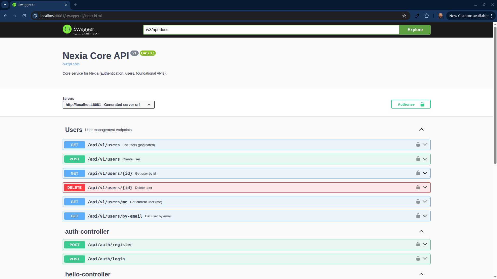

<p align="center">
  
</p>

# Nexia

**Nexia** is a modern, containerized backend platform built with **Spring Boot** and a supporting **Node BFF**, designed as a scalable foundation for authentication, user management, messaging, and observability.

The project focuses on:
- Clean architecture
- Production-like local environment (Docker)
- Observability (Prometheus + Grafana)
- API-first design (OpenAPI / Swagger)
- CI-ready workflows

---

## Features

- User registration & authentication (JWT)
- User management API
- PostgreSQL persistence with Flyway migrations
- RabbitMQ integration
- API documentation with Swagger / OpenAPI
- Observability stack:
  - Prometheus metrics
  - Grafana dashboards
- Fully containerized local environment (Docker Compose)
- CI pipeline ready (GitHub Actions)
- Testcontainers-based integration tests

---

## Tech Stack

- **Backend:** Java 21, Spring Boot 3
- **BFF / Frontend Support:** Node.js
- **Database:** PostgreSQL
- **Messaging:** RabbitMQ
- **API Docs:** SpringDoc OpenAPI (Swagger UI)
- **Observability:** Prometheus, Grafana
- **Containers:** Docker & Docker Compose
- **Build:** Maven
- **CI:** GitHub Actions

---

## Prerequisites

- Docker & Docker Compose
- Java 21 (Temurin recommended)
- Git
- Node.js 20+
- Make (optional, but recommended)

---

## Installation & Running (Full Stack)

```bash
# Build backend JAR
./mvnw -DskipTests package

# Start the entire stack
docker compose up -d --build
```

---

## Access URLs

- **Gateway:** http://localhost:8080
- **Core API (Swagger UI):** http://localhost:8081/swagger-ui.html
- **Core API Health:** http://localhost:8081/actuator/health
- **Prometheus:** http://localhost:9090
- **Grafana:** http://localhost:3000  
  - user: `admin`
  - pass: `admin`
- **RabbitMQ Management:** http://localhost:15672  
  - user: `nexia`
  - pass: `nexia`

---

## Local Development (Without Docker)

### Run backend tests
```bash
chmod +x mvnw
./mvnw test
```

### Build backend JAR
```bash
./mvnw -DskipTests package
```

### Run backend
```bash
./mvnw spring-boot:run
```

### Install BFF dependencies
```bash
cd nexia-bff
npm ci
```

---

## Local CI (Same intent as GitHub Actions)

From repo root:

```bash
make ci
```

If Docker is not available, run at least:

```bash
./mvnw test
./mvnw -DskipTests package
cd nexia-bff && npm ci
```

---

## API Example

Test endpoint:

```
GET http://localhost:8081/api/hello
```

---

## Commit Message Convention

This project uses **Conventional Commits**.

### Format
```
<type>: <short summary>
```

### Types
- `feat:` new feature
- `fix:` bug fix
- `docs:` documentation only
- `chore:` tooling, build, deps, cleanup
- `refactor:` code change without behavior change
- `test:` tests only

### Examples
- `feat: add JWT refresh endpoint`
- `fix: prevent NPE in login flow`
- `chore: update CI workflow`

---

## Project Structure

```
nexia-core/        # Spring Boot backend
nexia-bff/         # Node BFF
docs/
  adr/             # Architecture Decision Records
  images/          # README images and docs assets
.github/           # GitHub Actions & templates
```

---

## Documentation

- `CONTRIBUTING.md` — contribution rules & workflow
- `docs/BRANCHING.md` — branching strategy
- `docs/CODE_REVIEW.md` — code review standards
- `docs/adr/` — Architecture Decision Records

---

## Development Notes

- Database migrations are handled by **Flyway**
- Metrics are exposed to **Prometheus**
- Dashboards are visualized in **Grafana**
- Security is JWT-based (Spring Security)
- Integration tests use **Testcontainers**

---

## Creator

**Damir Bubanović**

- Website: https://damirbubanovic.com
- GitHub: https://github.com/damir-bubanovic
- YouTube: https://www.youtube.com/@damirbubanovic6608

---

## Acknowledgments

- Built with **Spring Boot**, **Docker**, and **PostgreSQL**
- Observability via **Prometheus** and **Grafana**
